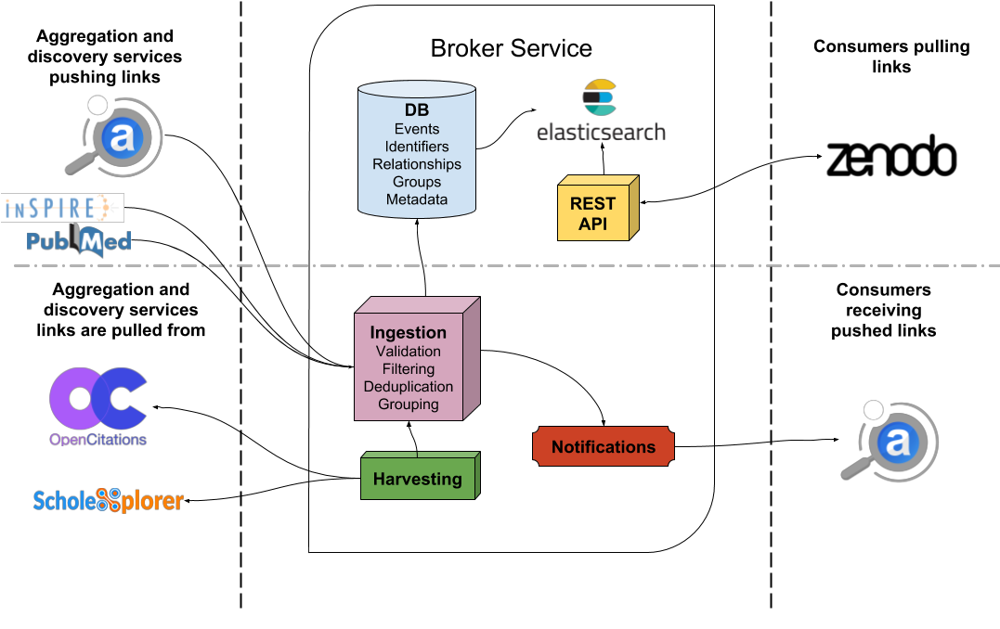
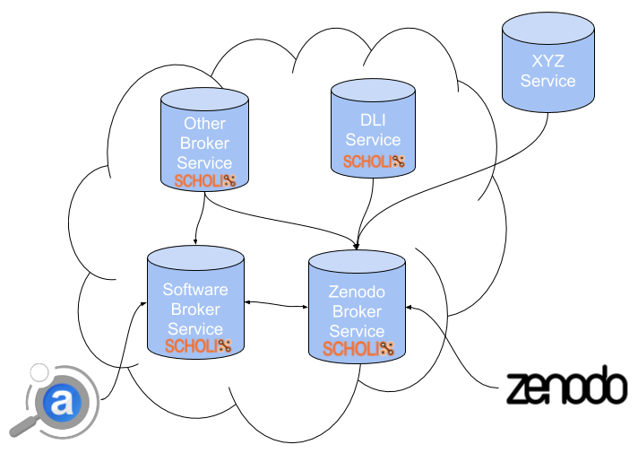

..
    Copyright (C) 2018 CERN.

    Asclepias Broker is free software; you can redistribute it and/or modify it
    under the terms of the MIT License; see LICENSE file for more details.

Interoperability
================

The Broker service is populating its links store through a variety of different
methods. Some of these are accepting data that is pushed from trusted external
sources while others actively harvest data from publicly available sources.

The common denominator between these methods is the format of the link data
which is based on `Scholix <http://www.scholix.org/>`_. Any data input that
arrives to the Broker is either pre-processed to comply or already complies
with the Scholix schema. This allows for a robust ingestion pipeline which can
keep track of the underlying scholarly objects, their identifiers and the
relationships between them.

On a higher level, Broker services aim at achieving interoperability with other
brokers or services which at this point were not able to formally communicate
with each other and exchange information. The goal is to build a Broker Network
where each participant focuses on maintaining the information that he has the
best domain knowledge on and ability to extract the most quiality information
from. This way the quality of the information is kept high and concentrated in
separate parts of the network, avoiding redundant information that is unused,
but at the same time allowing individual participants to decide about what
kind of information they want to store depending on their needs. In its
entirety, the network can then hold vast amounts of high quality knowledge in a
distributed manner.

For example, ADS has a specialized ingestion workflow for extracting various
forms of citations and references to software packages related to astrophysics.
For that reason it would make more sense for ADS to push this knowledge to a
*Software Broker* and not a *Humanities & Social Sciences Broker*.

