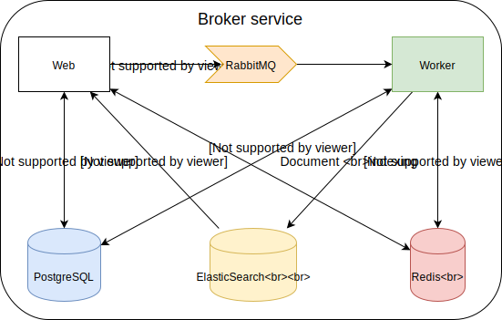

..
    Copyright (C) 2018 CERN.

    Asclepias Broker is free software; you can redistribute it and/or modify it
    under the terms of the MIT License; see LICENSE file for more details.

Systems
=======

Although the broker is considered a single service, to provide its
functionality it is split into applications and dependend services.

Applications
------------

Web (Flask/Invenio)
~~~~~~~~~~~~~~~~~~~

The web service is a Flask application using the Invenio framework. It handles
the REST API endpoints that receive and serve the data that the broker
processes and stores. It exposes two endpoints:

``/events``
  Used for receiving Scholix link data in the form of events in JSON format

``/relationships``
  Used for serving user queries for information regarding the graph, its
  objects and their metadata

Worker (Celery/Invenio)
~~~~~~~~~~~~~~~~~~~~~~~

The worker service is responsible for asynchronously running background tasks
that are initiated either via the web application or periodically (in a UNIX
``cron``-like fashion). These tasks usually involve processing events, updating
the graph state and indexing documents on Elasticsearch.

Services
--------

The broker's applications depend on some other services used mainly for sotrage
and operational purposes.

PostgreSQL
~~~~~~~~~~

This is the database of our choice that persistently stores the raw events and
graph state we described in the Data model section.

Elasticsearch
~~~~~~~~~~~~~

This is the searchable document store that is used to store denormalized
information from the graph.

RabbitMQ
~~~~~~~~

This is the message queue used for sending tasks to Celery from the web
application.

Redis
~~~~~

This is a key-value store used for various short-lived storage purposes. The
web application uses its for storing rate-limiting information. The worker uses
it for storing task state, task results and as a temporary cache that.
